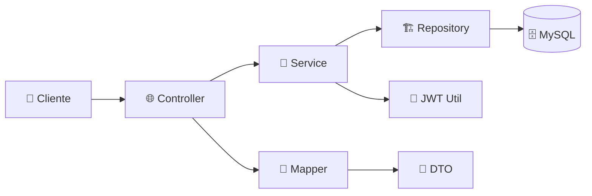
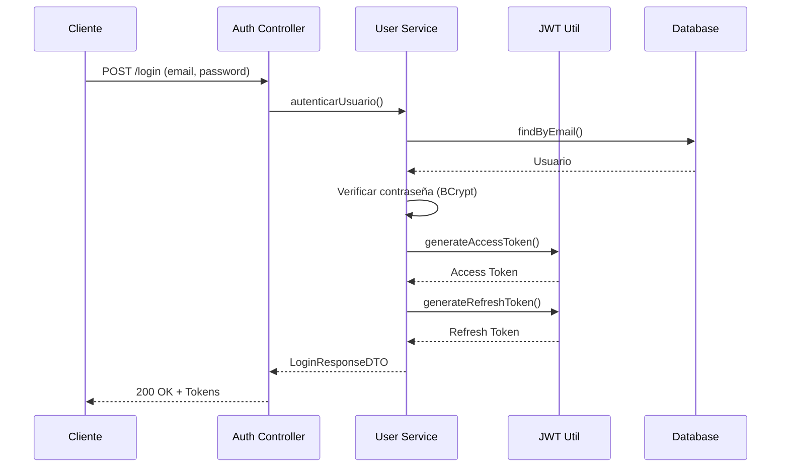

# 👤 User Service - Microservicio de Usuarios

[](https://spring.io/projects/spring-boot)
[](https://openjdk.java.net/)
[](https://github.com/jwtk/jjwt)
[](https://www.mysql.com/)

> **Microservicio especializado en gestión de usuarios, autenticación JWT y autorización basada en roles para Tienda Italo.**

## 📋 Tabla de Contenidos

- [🚀 Características](#-características)
- [🏗️ Arquitectura](#️-arquitectura)
- [📦 Instalación](#-instalación)
- [🔧 Configuración](#-configuración)
- [📚 API Endpoints](#-api-endpoints)
- [🔐 Seguridad](#-seguridad)
- [🧪 Testing](#-testing)
- [📊 Base de Datos](#-base-de-datos)

## 🚀 Características

### 🔐 **Autenticación Robusta**
- ✅ Registro de usuarios con validaciones comprehensivas
- ✅ Login con JWT (Access Token + Refresh Token)
- ✅ Recuperación de contraseña por email
- ✅ Verificación de email automatizada
- ✅ Bloqueo temporal por intentos fallidos

### 👥 **Gestión de Usuarios**
- ✅ CRUD completo de usuarios
- ✅ Sistema de roles granular (ADMIN, CLIENTE, GESTOR, VENDEDOR)
- ✅ Perfiles de usuario con información personal
- ✅ Gestión de direcciones múltiples
- ✅ Búsqueda y filtrado avanzado

### 📊 **Panel Administrativo**
- ✅ Estadísticas de usuarios en tiempo real
- ✅ Gestión de roles y permisos
- ✅ Activación/desactivación de cuentas
- ✅ Monitoreo de seguridad y accesos

### 🛡️ **Seguridad Empresarial**
- ✅ Contraseñas encriptadas con BCrypt (strength 12)
- ✅ Tokens JWT firmados y verificados
- ✅ Rate limiting en endpoints sensibles
- ✅ CORS configurado para producción
- ✅ Validaciones de entrada estrictas

## 🏗️ Arquitectura

### Clean Architecture Implementation

```
📁 src/main/java/com/login/user/
├── 🎯 domain/                    # Capa de Dominio
│   ├── entity/                   # Entidades de negocio
│   │   ├── Usuario.java         # Entidad principal de usuario
│   │   ├── Rol.java             # Roles del sistema
│   │   ├── DireccionUsuario.java # Direcciones de usuarios
│   │   └── TokenRecuperacion.java # Tokens de recuperación
│   └── repository/               # Contratos de repositorio
│       ├── UsuarioRepository.java
│       ├── RolRepository.java
│       └── TokenRecuperacionRepository.java
│
├── 🔧 application/               # Capa de Aplicación
│   ├── dto/                     # Data Transfer Objects
│   │   ├── UsuarioRequestDTO.java
│   │   ├── UsuarioResponseDTO.java
│   │   ├── LoginRequestDTO.java
│   │   ├── LoginResponseDTO.java
│   │   └── EstadisticasUsuarioDTO.java
│   └── service/                 # Servicios de aplicación
│       ├── UsuarioService.java  # Interface
│       └── impl/
│           └── UsuarioServiceImpl.java # Implementación
│
├── 🏗️ infrastructure/            # Capa de Infraestructura
│   ├── repository/              # Implementaciones JPA
│   │   ├── UsuarioRepositoryImpl.java
│   │   ├── RolRepositoryImpl.java
│   │   └── TokenRecuperacionRepositoryImpl.java
│   └── security/                # Configuración de seguridad
│       ├── JwtUtil.java         # Utilidad JWT
│       ├── JwtAuthenticationFilter.java # Filtro JWT
│       └── CustomUserDetailsService.java # UserDetails
│
├── 🌐 web/                      # Capa de Presentación
│   ├── controller/              # Controladores REST
│   │   ├── AuthController.java  # Endpoints de autenticación
│   │   ├── UsuarioController.java # Gestión de usuarios
│   │   └── GlobalExceptionHandler.java # Manejo de errores
│   └── mapper/                  # Mappers DTO-Entity
│       └── UsuarioMapper.java   # MapStruct mapper
│
└── ⚙️ config/                   # Configuraciones
    ├── SecurityConfig.java      # Configuración de Spring Security
    ├── OpenApiConfig.java       # Configuración de Swagger
    └── JwtConfigProperties.java # Propiedades JWT
```

### Flujo de Datos



## 📦 Instalación

### Prerrequisitos

- ☕ Java 17+
- 🗄️ MySQL 8.0+
- 📦 Maven 3.8+

### Instalación Local

1. **Clonar y navegar**
   ```bash
   git clone <repository-url>
   cd Back-end/user
   ```

2. **Configurar base de datos**
   ```sql
   CREATE DATABASE tienda_usuarios;
   CREATE USER 'tienda_user'@'localhost' IDENTIFIED BY 'TiendaPass2024!';
   GRANT ALL PRIVILEGES ON tienda_usuarios.* TO 'tienda_user'@'localhost';
   FLUSH PRIVILEGES;
   ```

3. **Ejecutar aplicación**
   ```bash
   ./mvnw spring-boot:run
   ```

4. **Verificar instalación**
   - API: http://localhost:8081/api/users/health
   - Swagger: http://localhost:8081/swagger-ui.html

## 🔧 Configuración

### application.properties

```properties
# Configuración del servidor
server.port=8081
server.servlet.context-path=/api/users

# Base de datos
spring.datasource.url=jdbc:mysql://localhost:3306/tienda_usuarios
spring.datasource.username=tienda_user
spring.datasource.password=TiendaPass2024!

# JWT
jwt.secret=TiendaItaloSecretKey2024ForUserAuthentication
jwt.expiration=86400000
jwt.refresh-expiration=604800000

# Flyway
spring.flyway.enabled=true
spring.flyway.baseline-on-migrate=true
```

### Variables de Entorno

```bash
# Desarrollo
export SPRING_PROFILES_ACTIVE=dev
export DB_HOST=localhost
export DB_PORT=3306
export JWT_SECRET=your-secret-key

# Producción
export SPRING_PROFILES_ACTIVE=prod
export DB_HOST=prod-mysql-host
export JWT_SECRET=your-production-secret
```

## 📚 API Endpoints

### 🔐 Autenticación Pública

| Método | Endpoint | Descripción | Autenticación |
|--------|----------|-------------|---------------|
| `POST` | `/register` | Registro de usuario | ❌ No |
| `POST` | `/login` | Inicio de sesión | ❌ No |
| `POST` | `/refresh-token` | Renovar token | ❌ No |
| `POST` | `/forgot-password` | Recuperar contraseña | ❌ No |
| `POST` | `/reset-password` | Restablecer contraseña | ❌ No |
| `GET` | `/verify-email` | Verificar email | ❌ No |
| `GET` | `/check-email` | Verificar disponibilidad | ❌ No |
| `GET` | `/health` | Estado del servicio | ❌ No |

### 👤 Gestión Personal

| Método | Endpoint | Descripción | Roles |
|--------|----------|-------------|-------|
| `GET` | `/profile` | Obtener perfil actual | 🔐 Autenticado |
| `PUT` | `/profile` | Actualizar perfil | 🔐 Autenticado |
| `POST` | `/profile/change-password` | Cambiar contraseña | 🔐 Autenticado |

### 👥 Administración (ADMIN)

| Método | Endpoint | Descripción | Roles |
|--------|----------|-------------|-------|
| `GET` | `/users` | Listar usuarios | 👑 ADMIN |
| `GET` | `/users/{id}` | Usuario por ID | 👑 ADMIN |
| `PUT` | `/users/{id}` | Actualizar usuario | 👑 ADMIN |
| `POST` | `/users/{id}/activate` | Activar usuario | 👑 ADMIN |
| `POST` | `/users/{id}/deactivate` | Desactivar usuario | 👑 ADMIN |
| `POST` | `/users/{id}/unlock` | Desbloquear usuario | 👑 ADMIN |
| `DELETE` | `/users/{id}` | Eliminar usuario | 👑 ADMIN |

### 🔍 Búsqueda (ADMIN/GESTOR)

| Método | Endpoint | Descripción | Roles |
|--------|----------|-------------|-------|
| `GET` | `/users/search?termino=` | Buscar por nombre | 👑 ADMIN, 🔧 GESTOR |
| `GET` | `/users/by-role/{role}` | Filtrar por rol | 👑 ADMIN, 🔧 GESTOR |
| `GET` | `/users/active` | Usuarios activos | 👑 ADMIN, 🔧 GESTOR |

### 🎭 Gestión de Roles (ADMIN)

| Método | Endpoint | Descripción | Roles |
|--------|----------|-------------|-------|
| `POST` | `/users/{userId}/roles/{roleId}` | Asignar rol | 👑 ADMIN |
| `DELETE` | `/users/{userId}/roles/{roleId}` | Remover rol | 👑 ADMIN |

### 📊 Estadísticas (ADMIN)

| Método | Endpoint | Descripción | Roles |
|--------|----------|-------------|-------|
| `GET` | `/statistics` | Estadísticas del sistema | 👑 ADMIN |

## 🔐 Seguridad

### Roles del Sistema

| Rol | Descripción | Permisos |
|-----|-------------|----------|
| 👑 **ADMIN** | Administrador del sistema | Acceso completo a todas las funciones |
| 🛒 **CLIENTE** | Cliente registrado | Gestión de perfil personal, compras |
| 🔧 **GESTOR** | Gestor de inventario | Gestión de productos y pedidos |
| 💼 **VENDEDOR** | Vendedor | Gestión de productos y ventas |

### Flujo de Autenticación JWT



### Validaciones de Seguridad

```java
// Ejemplo de validaciones en UsuarioRequestDTO
@NotBlank(message = "El email es obligatorio")
@Email(message = "El email debe tener un formato válido")
@Size(max = 255, message = "El email no puede exceder 255 caracteres")
private String email;

@NotBlank(message = "La contraseña es obligatoria")
@Size(min = 8, max = 100, message = "La contraseña debe tener entre 8 y 100 caracteres")
@Pattern(
    regexp = "^(?=.*[a-z])(?=.*[A-Z])(?=.*\\d)(?=.*[@$!%*?&])[A-Za-z\\d@$!%*?&]{8,}$",
    message = "La contraseña debe contener al menos: 1 minúscula, 1 mayúscula, 1 número y 1 carácter especial"
)
private String password;
```

## 🧪 Testing

### Ejecutar Tests

```bash
# Tests unitarios
./mvnw test

# Tests de integración
./mvnw integration-test

# Tests específicos
./mvnw test -Dtest=UsuarioServiceTest

# Con cobertura
./mvnw jacoco:report
```

### Estructura de Tests

```
📁 src/test/java/com/login/user/
├── 🧪 unit/                     # Tests unitarios
│   ├── service/
│   │   └── UsuarioServiceTest.java
│   └── mapper/
│       └── UsuarioMapperTest.java
├── 🔗 integration/              # Tests de integración
│   ├── controller/
│   │   ├── AuthControllerTest.java
│   │   └── UsuarioControllerTest.java
│   └── repository/
│       └── UsuarioRepositoryTest.java
└── 🏗️ architecture/             # Tests de arquitectura
    └── ArchitectureTest.java
```

### Coverage Report

El reporte de cobertura se genera en:
- `target/site/jacoco/index.html`

Objetivos de cobertura:
- **Líneas**: > 80%
- **Ramas**: > 70%
- **Métodos**: > 85%

## 📊 Base de Datos

### Esquema de Tablas

```sql
-- Tabla principal de usuarios
CREATE TABLE usuarios (
    id BIGINT AUTO_INCREMENT PRIMARY KEY,
    email VARCHAR(255) NOT NULL UNIQUE,
    nombre VARCHAR(100) NOT NULL,
    apellido VARCHAR(100) NOT NULL,
    password_hash VARCHAR(255) NOT NULL,
    telefono VARCHAR(20),
    fecha_nacimiento DATE,
    activo BOOLEAN DEFAULT TRUE,
    email_verificado BOOLEAN DEFAULT FALSE,
    fecha_ultimo_acceso TIMESTAMP NULL,
    intentos_fallidos_login INT DEFAULT 0,
    bloqueado_hasta TIMESTAMP NULL,
    created_at TIMESTAMP DEFAULT CURRENT_TIMESTAMP,
    updated_at TIMESTAMP DEFAULT CURRENT_TIMESTAMP ON UPDATE CURRENT_TIMESTAMP
);

-- Tabla de roles
CREATE TABLE roles (
    id BIGINT AUTO_INCREMENT PRIMARY KEY,
    nombre VARCHAR(50) NOT NULL UNIQUE,
    descripcion VARCHAR(200),
    activo BOOLEAN DEFAULT TRUE,
    created_at TIMESTAMP DEFAULT CURRENT_TIMESTAMP,
    updated_at TIMESTAMP DEFAULT CURRENT_TIMESTAMP ON UPDATE CURRENT_TIMESTAMP
);

-- Tabla de relación usuarios-roles
CREATE TABLE usuario_roles (
    id BIGINT AUTO_INCREMENT PRIMARY KEY,
    usuario_id BIGINT NOT NULL,
    rol_id BIGINT NOT NULL,
    asignado_por BIGINT,
    fecha_asignacion TIMESTAMP DEFAULT CURRENT_TIMESTAMP,
    FOREIGN KEY (usuario_id) REFERENCES usuarios(id) ON DELETE CASCADE,
    FOREIGN KEY (rol_id) REFERENCES roles(id) ON DELETE CASCADE,
    UNIQUE KEY unique_usuario_rol (usuario_id, rol_id)
);
```

### Migraciones Flyway

Las migraciones se encuentran en `src/main/resources/db/migration/`:

- `V1__create_users_and_roles_tables.sql` - Estructura inicial
- `V2__insert_default_roles.sql` - Roles por defecto
- `V3__create_admin_user.sql` - Usuario administrador

### Índices Importantes

```sql
-- Índices para optimizar consultas frecuentes
CREATE INDEX idx_usuarios_email ON usuarios(email);
CREATE INDEX idx_usuarios_activo ON usuarios(activo);
CREATE INDEX idx_usuarios_created_at ON usuarios(created_at);
CREATE INDEX idx_usuario_roles_usuario_id ON usuario_roles(usuario_id);
CREATE INDEX idx_tokens_token ON tokens_recuperacion(token);
```

## 📈 Monitoreo

### Spring Boot Actuator

Endpoints de monitoreo disponibles (solo para ADMIN):

- `/actuator/health` - Estado de salud
- `/actuator/metrics` - Métricas de rendimiento
- `/actuator/info` - Información de la aplicación

### Métricas Importantes

- Tiempo de respuesta promedio
- Número de usuarios activos
- Intentos de login fallidos
- Uso de memoria y CPU
- Conexiones de base de datos

### Logs

Configuración de logs por ambiente:

```yaml
# application-dev.yml
logging:
  level:
    com.login.user: DEBUG
    org.springframework.security: DEBUG
    org.hibernate.SQL: DEBUG

# application-prod.yml
logging:
  level:
    com.login.user: INFO
    root: WARN
  file:
    name: logs/user-service.log
```

## 🚀 Despliegue

### Docker

```dockerfile
FROM openjdk:17-jdk-slim

COPY target/user-service-1.0.0.jar app.jar

EXPOSE 8081

ENTRYPOINT ["java", "-jar", "/app.jar"]
```

```bash
# Construir imagen
docker build -t tienda-italo/user-service .

# Ejecutar contenedor
docker run -p 8081:8081 \
  -e SPRING_PROFILES_ACTIVE=prod \
  -e DB_HOST=mysql-container \
  tienda-italo/user-service
```

### Kubernetes

```yaml
apiVersion: apps/v1
kind: Deployment
metadata:
  name: user-service
spec:
  replicas: 3
  selector:
    matchLabels:
      app: user-service
  template:
    metadata:
      labels:
        app: user-service
    spec:
      containers:
      - name: user-service
        image: tienda-italo/user-service:latest
        ports:
        - containerPort: 8081
        env:
        - name: SPRING_PROFILES_ACTIVE
          value: "prod"
        - name: DB_HOST
          valueFrom:
            secretKeyRef:
              name: db-secret
              key: host
```

## 🔧 Troubleshooting

### Problemas Comunes

1. **Error de conexión a base de datos**
   ```bash
   # Verificar conexión
   mysql -h localhost -u tienda_user -p tienda_usuarios
   
   # Verificar configuración
   grep spring.datasource src/main/resources/application.properties
   ```

2. **Token JWT inválido**
   ```bash
   # Verificar configuración JWT
   grep jwt. src/main/resources/application.properties
   
   # Verificar logs
   tail -f logs/user-service.log | grep JWT
   ```

3. **Error de validación**
   ```bash
   # Verificar estructura de request en Swagger
   curl -X POST http://localhost:8081/swagger-ui.html
   ```

### Logs Útiles

```bash
# Seguir logs en tiempo real
tail -f logs/user-service.log

# Filtrar errores
grep ERROR logs/user-service.log

# Filtrar autenticación
grep "Authentication" logs/user-service.log
```

## 🤝 Contribuir

### Guías de Desarrollo

1. **Código**: Seguir Google Java Style Guide
2. **Tests**: Mínimo 80% de cobertura
3. **Commits**: Conventional Commits
4. **Documentación**: JavaDoc para métodos públicos

### Workflow

1. Fork del repositorio
2. Branch: `feature/nueva-funcionalidad`
3. Desarrollar con tests
4. Pull Request con descripción detallada

---

## 📞 Contacto

- **Desarrollador**: Felipe Norambuena
- **Email**: dev@tienda-italo.com
- **Documentación**: [API Docs](http://localhost:8081/swagger-ui.html)

---

<div align="center">

**[⬆️ Volver al inicio](#-user-service---microservicio-de-usuarios)**


</div>
